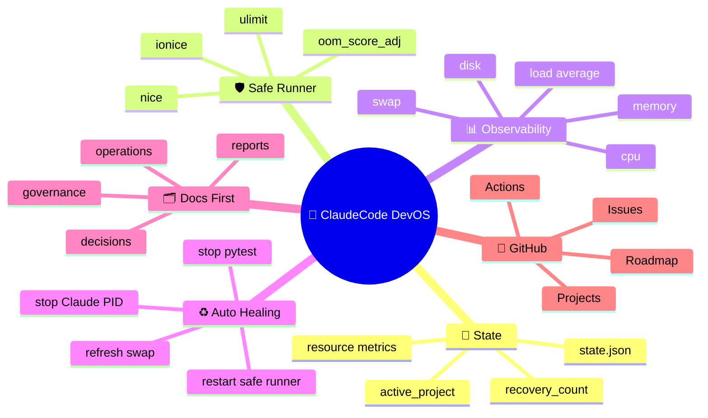
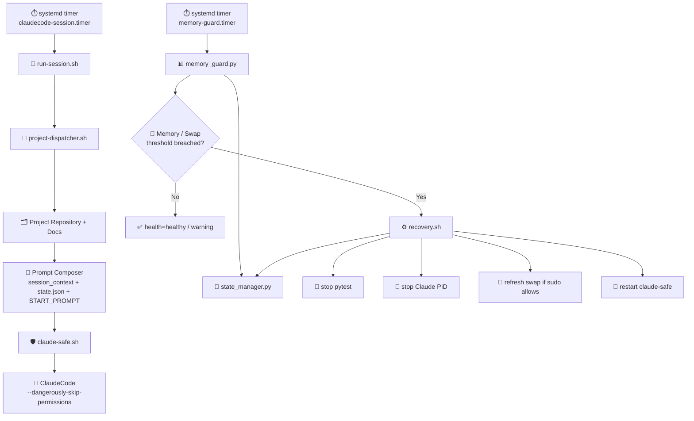
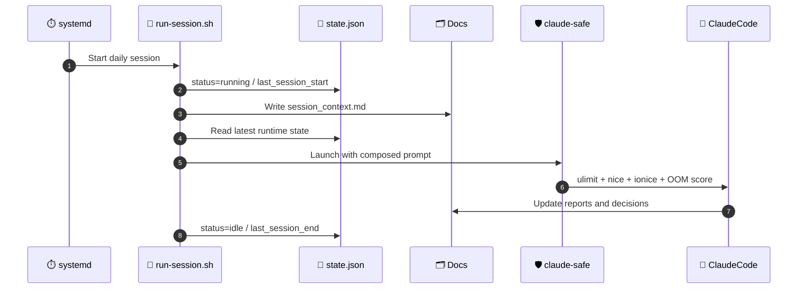
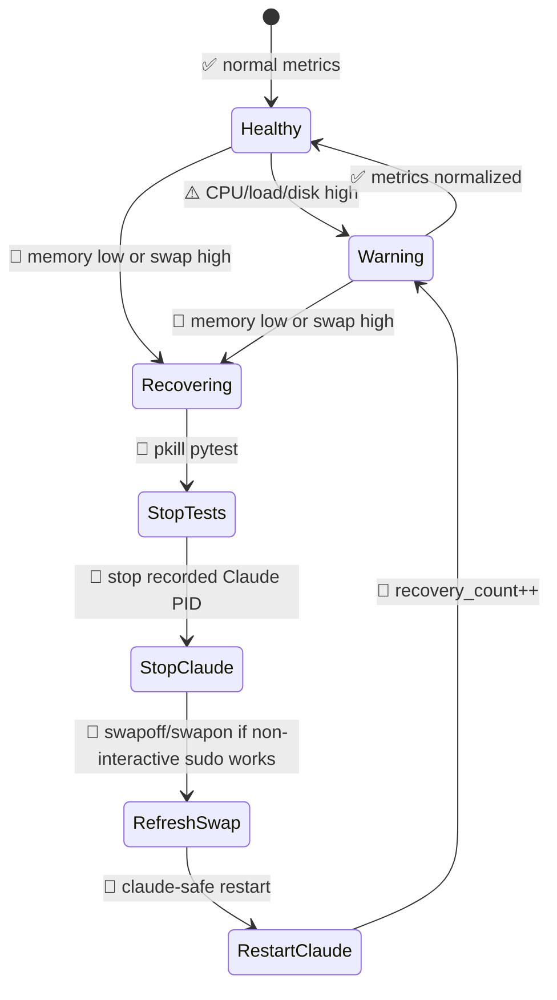
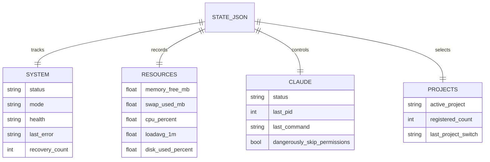
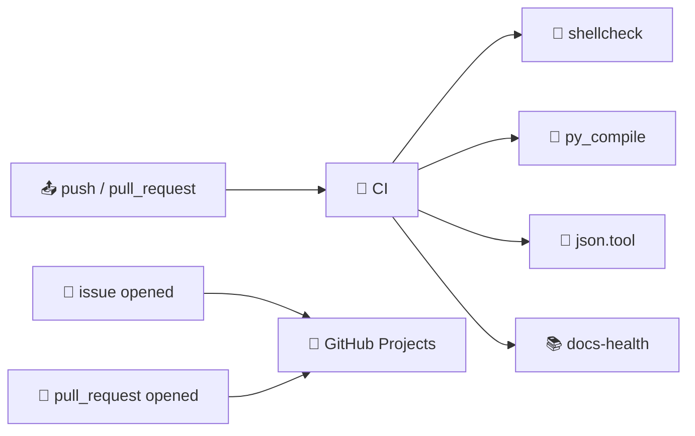
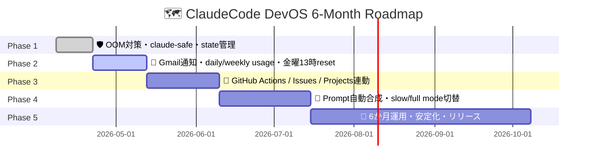

# 🐧 ClaudeCode Linux Autonomous Dev Platform


## 🌟 目的

**ClaudeCode Linux Autonomous Dev Platform** は、Ubuntuネイティブ環境でClaudeCodeを長時間運用するための自律開発基盤です。

🧠 `state.json` を中枢に、🛡️ `claude-safe`、📊 `memory_guard`、♻️ Auto Healing、🗂️ Docs First、⏱️ systemd timerを組み合わせ、**落ちないことより、落ちても自動復帰すること**を優先します。

---

## 🧭 コンセプトマップ



---

## 🏗️ 全体アーキテクチャ



---

## 🔁 ClaudeOS 5時間ループ



---

## ♻️ Auto Healing 判定フロー



---

## 📦 ディレクトリ構成

```text
claudecode-devos/
├── 🧰 bin/
│   ├── claude-safe.sh
│   ├── run-session.sh
│   ├── project-dispatcher.sh
│   └── backup-docs.sh
├── ⚙️ config/
│   ├── devos.env
│   ├── projects.json
│   └── state.json
├── 🗂️ docs/
│   ├── 00_governance/
│   ├── 01_projects/
│   ├── 02_architecture/
│   ├── 03_operations/
│   ├── 04_logs/
│   ├── 05_reports/
│   └── 06_decisions/
├── 🧠 ops/
│   ├── memory_guard.py
│   ├── recovery.sh
│   ├── state_manager.py
│   └── metrics_snapshot.py
├── 🏃 runtime/
│   ├── logs/
│   ├── pids/
│   ├── tmp/
│   └── metrics/
└── ⏱️ systemd/
    ├── claudecode-session.service
    ├── claudecode-session.timer
    ├── memory-guard.service
    └── memory-guard.timer
```

---

## 🚀 クイックスタート

```bash
sudo SERVICE_USER=kensan ./claudecode-devos/install.sh
python3 -m pip install --user -r /opt/claudecode-devos/requirements.txt
sudo systemctl enable --now memory-guard.timer
sudo systemctl enable --now claudecode-session.timer
```

### ✅ ローカル検証

```bash
DEVOS_HOME="$PWD/claudecode-devos" python3 claudecode-devos/ops/state_manager.py get system.status
DEVOS_HOME="$PWD/claudecode-devos" python3 claudecode-devos/ops/metrics_snapshot.py
DEVOS_HOME="$PWD/claudecode-devos" MIN_FREE_MB=0 MAX_SWAP_USED_MB=999999 python3 claudecode-devos/ops/memory_guard.py
```

---

## 🧠 state.json の役割



---

## 🛠️ GitHub Actions

このリポジトリでは、GitHub ActionsをCI/運用検証に使います。

| Workflow | 役割 | 主な検証 |
| --- | --- | --- |
| 🧪 `ci.yml` | Bash/Python検証 | `shellcheck`, `py_compile`, JSON validation |
| 📚 `docs-health.yml` | Docs健全性 | README、運用Docs、Mermaidブロックの存在確認 |
| 📌 `project-automation.yml` | GitHub Projects連携 | Issue/PRをProjectへ自動追加 |



---

## 📌 GitHub Projects 運用

GitHub Projectsはリポジトリ設定で有効化済みです。推奨ボード:

🎯 **ClaudeCode DevOS Roadmap**

| View | 用途 |
| --- | --- |
| 🧭 Roadmap | 6か月ロードマップ |
| 🧪 CI / Quality | GitHub Actions失敗、テスト、検証 |
| ♻️ Auto Healing | OOM、memory guard、recovery改善 |
| 🗂️ Docs First | Docs、日報、decision log |
| 🚀 Release | 183日リリース目標の管理 |

Project連携ワークフローを動かすには、Repository Secretに `PROJECTS_TOKEN` を設定し、`PROJECT_URL` を対象Project URLに差し替えてください。

---

## 🗺️ 開発ロードマップ



---

## ⚠️ 運用上の注意

- 🧨 `--dangerously-skip-permissions` 前提のため、対象リポジトリと実行ユーザーを限定してください。
- 🛡️ `claude-safe.sh` 経由で起動し、直接 `claude` を常時実行しないでください。
- 💽 swap refreshは `sudo -n` が通る場合のみ実行されます。
- 📊 CPU/load/diskはwarning扱い、memory/swap異常をrecovery発火条件にしています。
- 🗂️ DocsをSingle Source of Truthとして更新してください。

---

## 📚 関連ドキュメント

- 🧰 [DevOS配布ツリー](./claudecode-devos/README.md)
- 📚 [ルートDocs索引](./docs/00_索引（Index）.md)
- 🛡️ [運用ポリシー](./claudecode-devos/docs/00_governance/operations_policy.md)
- 📊 [ランタイムルール](./claudecode-devos/docs/03_operations/runtime_rules.md)
- 🧠 [アーキテクチャ概要](./claudecode-devos/docs/02_architecture/overview.md)
- 📌 [GitHub運用メモ](./docs/07_GitHub連携（GitHubIntegration）/03_ProjectsとActions（ProjectsAndActions）.md)
